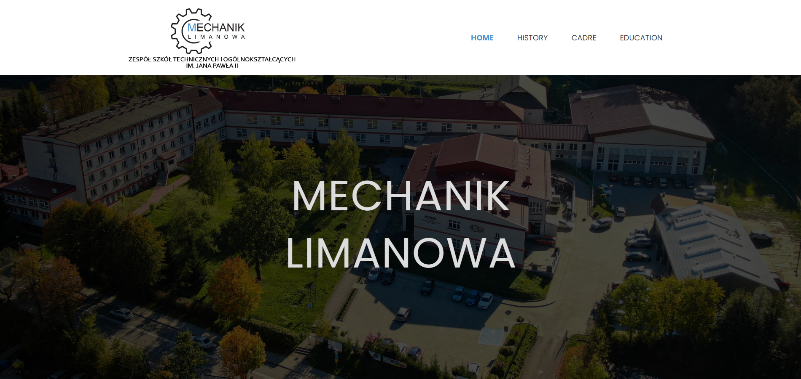

<h3 align="center">Mechanik Limanowa school site</h3>

  

   This is a project, made as an extra activity in school. The project is an example of my school's website. 
     
    <a href="https://szafter12.github.io/Mechanik-school-site/">View Demo</a>
  

## About The Project

the website was made on the basis of the original school website, but I modelled only the appearance of the code I wrote myself and implemented everything myself 

(<a href="#readme-top">back to top</a>)

### Built With

HTML
SCSS
JavaScript

(<a href="#readme-top">back to top</a>)

## Contact

Jakub Pachut - jakubpachut@gmail.com

Project Link: https://github.com/Szafter12/Mechanik-school-site

(<a href="#readme-top">back to top</a>)

